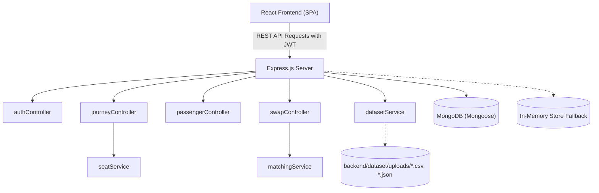

# Architecture

## High-Level Architecture

RailTogether is built as a decoupled full-stack web application:
- **Client Tier**: React Single Page Application (SPA) built with Vite and styled with Tailwind CSS, communicating via Axios with a RESTful Express backend.
- **Server Tier**: Express.js server providing routing, domain matching algorithms, and dataset normalization services.
- **Persistence Tier**: MongoDB using Mongoose schemas, supplemented by an in-memory data store for fallback reliability.



## Directory Structure

- `frontend/`:
  - `src/components/`: Primitives (`Navbar` with journey selector, `Button`, `Card`/`SectionLabel`, `Badge`, `Modal`, `EmptyState`, `LoadingSpinner`, `LoadingScreen` boot, `PageTransition`, `Footer`) and railway visualizers (`CoachViz` animated bay strip, `SeatMap`, `SeatCard`, `GroupTicket`, `RouteMap`, `MatchCard`, `SwapRequestCard`, `JourneySummary`, `HeroScene`/`HeroScene3D` Three.js hero).
  - `src/pages/`: `Landing` (3D hero + How-It-Works), `Login`, `Register`, `Dashboard`, `Groups`, `GroupDetail`, `Matches` (also `/journey/:id/recommendations`), `Requests`, `JourneyDetails`, `SeatMapPage`, `CreateJourney`, `Notifications`, `Profile`.
  - `src/lib/motion.jsx`: lazy GSAP/Three loaders + reveal hooks (reduced-motion aware).
  - `src/context/`: `AuthContext.jsx` (JWT session) + `JourneyContext.jsx` (active journey for navbar selector, localStorage-persisted).
  - `src/services/`: Axios API modules (`api.js`, `authService.js`, `journeyService.js`, `passengerService.js`, `swapService.js`).
  - `src/utils/`: `formatters.js`, `seatUtils.js`, `groupUtils.js` (API-shape contract helpers: extractGroups, buildSeatClusters, getSeparatedSeatNumbers), `constants.js` (RailSaathi copy, disclaimers, product rules).
- `backend/`:
  - `config/`: MongoDB connection setup (`db.js`).
  - `controllers/`: HTTP request handlers for auth, journeys, passengers, and swaps.
  - `models/`: Mongoose schemas (`User.js`, `Journey.js`, `Passenger.js`, `SwapRequest.js`).
  - `routes/`: Express endpoint declarations.
  - `services/`: Domain logic for matching (`matchingService.js`), seat mapping (`seatService.js`), and dataset file loading (`datasetService.js`).
  - `utils/`: Coach bay split mathematics (`seatUtils.js`, incl. per-group `analyzeGroupSplits`) and matching scoring weights (`matchingUtils.js`).
  - `dataset/uploads/`: Dedicated directory for user-provided synthetic datasets.

## Important Components

| Component | Location | Purpose | Dependencies / Relations |
| :--- | :--- | :--- | :--- |
| `SeatMap` | `frontend/src/components/SeatMap.jsx` | Renders coach bays, compartments & seats | Uses `SeatCard`, interacts with swap modal |
| `MatchCard` | `frontend/src/components/MatchCard.jsx` | Shows compatibility score & reasons | Triggers swap modal on exchange request |
| `SwapRequestCard` | `frontend/src/components/SwapRequestCard.jsx` | Manages pending/confirmed swap cards | Dispatches accept/reject/cancel requests |
| `matchingService` | `backend/services/matchingService.js` | Generates ranked exchange recommendations (per-group clusters; candidates include willing members of other groups) | Uses `seatUtils` and `matchingUtils` |
| `seatService` | `backend/services/seatService.js` | Generates 72-berth seat map data structure (per-group split coloring; amber = best target per separated passenger) | Uses `seatUtils` to calculate bay groupings |
| `datasetService` | `backend/services/datasetService.js` | Parses synthetic CSV/JSON files (cached by uploads-folder mtimes) | Reads from `backend/dataset/uploads/` |

## Application Flow

```text
User Action (e.g. Request Swap)
  │
  ▼
React Component (`MatchCard` / `Modal`)
  │
  ▼
Client Service (`swapService.createSwapRequest`)
  │
  ▼
Axios Client with JWT Interceptor (`/api/swaps`)
  │
  ▼
Express Router (`swapRoutes.js`) -> `authMiddleware.js`
  │
  ▼
Controller (`swapController.createSwapRequest`)
  │
  ▼
Mongoose Model (`SwapRequest.create`) or In-Memory Store
  │
  ▼
Response JSON (201 Created with Status PENDING)
  │
  ▼
React UI updates status badge & redirects to `/swaps`
```

## API Structure

- **Auth** (`/api/auth`):
  - `POST /register`: Create passenger account.
  - `POST /login`: Authenticate with email/password.
  - `GET /me`: Get authenticated user profile.
  - (`POST /demo` removed — demo login was removed entirely.)
- **Journeys** (`/api/journeys`):
  - `GET /`: List journeys (auto-seeds the synthetic dataset on first call if dataset journeys are absent, after purging legacy demo docs).
  - `POST /`: Create journey with passengers.
  - `GET /:id`: Retrieve journey details and split analysis.
  - `GET /:id/seatmap`: Retrieve coach seat map layout.
  - `DELETE /:id`: Remove journey and associated passengers/swaps.
  - (`POST /demo-seed` removed — demo journey seeding was removed entirely.)
- **Passengers** (`/api/passengers`):
  - `POST /`: Add passenger to journey.
  - `GET /journey/:journeyId`: List passengers by journey.
  - `PATCH /:id`: Update passenger or seat allocation.
- **Swaps & Matching** (`/api/swaps`, `/api/journeys`):
  - `GET /api/journeys/:journeyId/matches`: Get compatibility-ranked matches.
  - `POST /api/swaps`: Create swap request.
  - `GET /api/swaps/received`: List received swap requests.
  - `GET /api/swaps/sent`: List sent swap requests.
  - `POST /api/swaps/:id/accept`: Confirm swap and exchange seats.
  - `POST /api/swaps/:id/reject`: Decline swap.
  - `POST /api/swaps/:id/cancel`: Cancel pending swap.
  - `GET /api/swaps/notifications`: Retrieve journey alerts.
- **Dataset** (`/api/dataset`):
  - `GET /status`: Inspect uploads directory status.
  - `POST /load`: Parse and load synthetic files.

## Database Structure

- **`User`**: `name`, `email` (unique), `phone`, `password` (bcrypt hash).
- **`Journey`**: `pnr`, `trainNumber`, `trainName`, `source`, `destination`, `journeyDate`, `coach`, `createdBy`, `status`.
- **`Passenger`**: `name`, `journeyId` (ref Journey), `userId` (ref User), `groupId`, `coach`, `seatNumber`, `berthType`, `ageCategory`, `bookingStatus`, `isAvailableForSwap`.
- **`SwapRequest`**: `journeyId` (ref Journey), `requesterPassengerId` (ref Passenger), `targetPassengerId` (ref Passenger), `requesterSeat` (`coach`, `seatNumber`, `berthType`), `targetSeat` (`coach`, `seatNumber`, `berthType`), `reason`, `matchScore`, `status` (`PENDING`, `ACCEPTED`, `REJECTED`, `CANCELLED`).

## Authentication Flow

1. User registers or logs in via `/api/auth/login`.
2. Server signs a JWT token containing `{ id, name, email }`.
3. Client stores `railtogether_token` in `localStorage`.
4. Axios interceptor attaches `Authorization: Bearer <token>` to outbound requests.
5. Server `authMiddleware` validates JWT using `process.env.JWT_SECRET` (with guest fallback support).

## External Services
- No external private or proprietary railway APIs are used.
- Google Fonts CDN: Fraunces, Inter, IBM Plex Mono.
- Frontend animation/3D: `gsap` (lazy via `lib/motion.jsx`), `three` (lazy chunk, landing hero only,
  DPR-capped, full disposal, SVG fallback for mobile/reduced-motion/no-WebGL).
